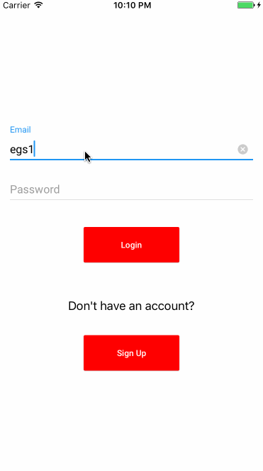

# Launch Day

**Launch Day** is an iOS app that allows a gamer to search and find video games that are currently out or track games that are yet to release.  The user can keep a wish list of games that includes games they might have pre-ordered to get real time notifications on release information (or price info TBD). Also, looking to integrate apple watch support to be able to view/edit wishlist from the apple watch. We will be using the data that is freely provided by the Internet Game Database (<a href="https://www.igdb.com/api">igdb.com</a>).

## User Stories

The following **core** user stories:

- [ ] User can create account and log in with their credentials
    - [ ] Persist user across app restarts
- [ ] Allow gamers to search an expansive database of games (provided by igdb.com)
- [ ] User can see more details for a game chosen from the database (game details, rating, screenshots, etc.)
    - [ ] User can see trailers for a game
- [ ] Allow user to track unreleased games and stay up to date on release info by adding them to a wish list that is easily accessible
- [ ] Allow user to set notification preferences for games in which they want to receive up to date notifications for release info
- [ ] Random Game Suggestor - randomly suggests a new/popular game based on the users filters
- [ ] If user wants to buy a game, we will provide a button that will take them to a website where they can purchase it
- [ ] User can edit their profile and customize settings

The following **optional** features are implemented:

- [ ] User can share his/her wishlist with friends
- [ ] Apple Watch support
- [ ] Custom notification settings on a per game basis

## Sprint 1
- [x] User can create account and log in with their credentials
    - [x] Persist user across app restarts
- [x] Allow gamers to get data from an expansive database of games (provided by igdb.com)
    - [x] Populate data via UICollectionView
- [x] Established MVVM architecture for our app

## Data Schema 

Here's a walkthrough of the model classes for our app:

**User**

**Game**

## Video Walkthrough 

Here's a walkthrough of implemented user stories:

**Sprint 1**

GIF created with [LiceCap](http://www.cockos.com/licecap/).

## License

    Copyright [2017] [Eric Suarez]

    Licensed under the Apache License, Version 2.0 (the "License");
    you may not use this file except in compliance with the License.
    You may obtain a copy of the License at

        http://www.apache.org/licenses/LICENSE-2.0

    Unless required by applicable law or agreed to in writing, software
    distributed under the License is distributed on an "AS IS" BASIS,
    WITHOUT WARRANTIES OR CONDITIONS OF ANY KIND, either express or implied.
    See the License for the specific language governing permissions and
    limitations under the License.
